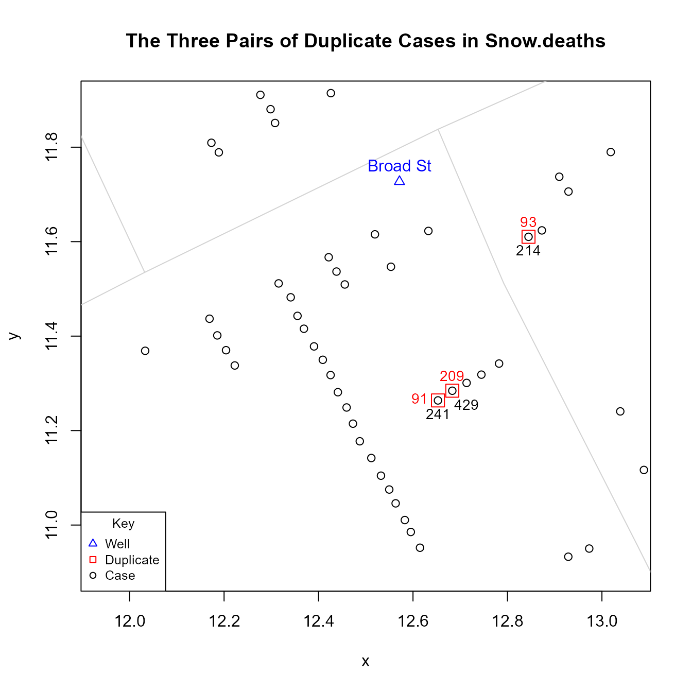
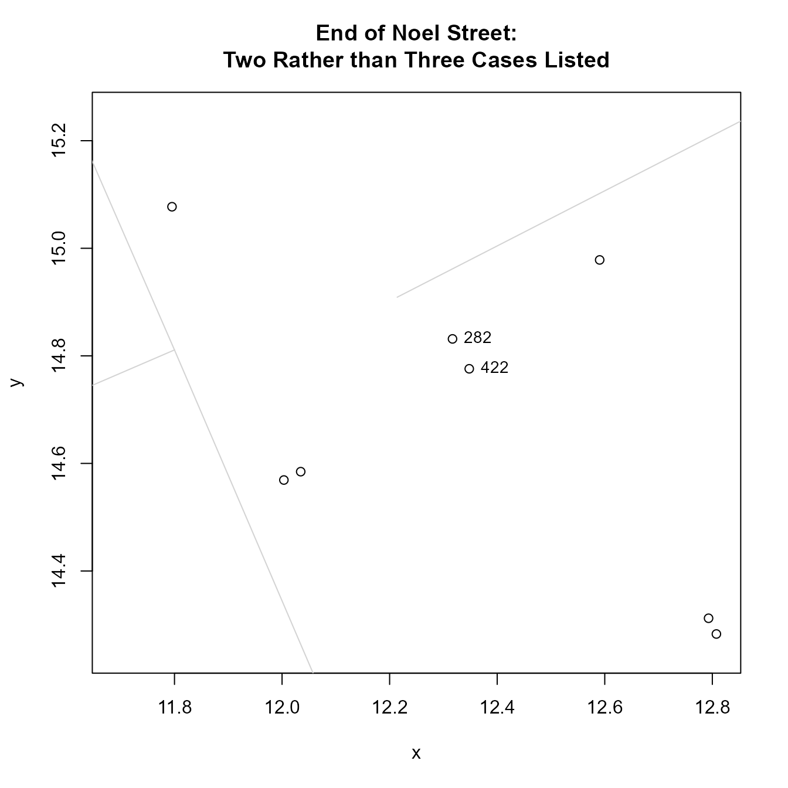
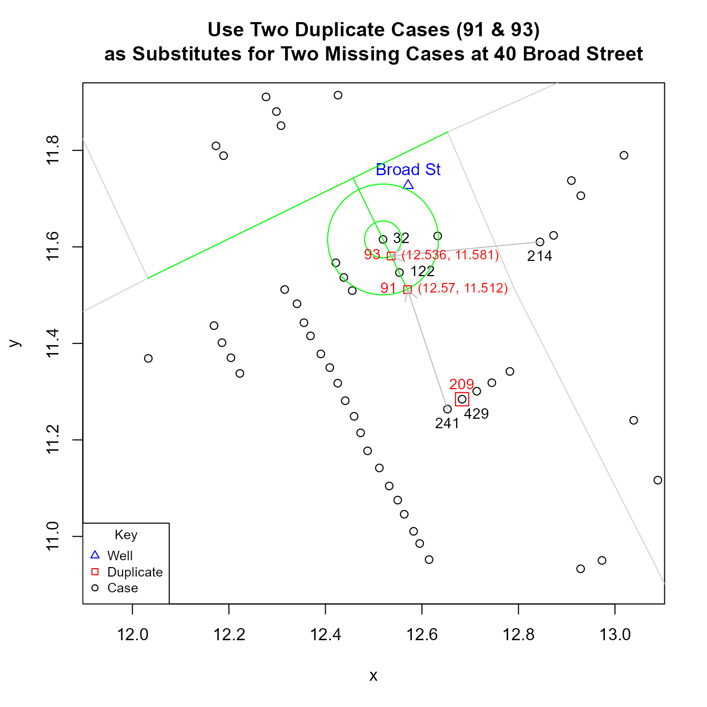

# Duplicate and Missing Cases in Snow.deaths

John Snow’s map of the 1854 Cholera outbreak in London, published in his
1855 book *On The Mode Of Communication Of Cholera* and reprinted in
Edward Tufte’s 1997 *Visual Explanations: Images and Quantities,
Evidence and Narrative*, records 578 cases. However, while the
`Snow.deaths` data set also lists 578 cases, only 575 are unique: there
are three pairs of cases that have identical “x” and “y” coordinates: 1)
93 and 214; 2) 91 and 241; and 3) 209 and 429.

``` r
library(HistData)

duplicates <- Snow.deaths[(duplicated(Snow.deaths[, c("x", "y")])), ]

duplicates.id <- lapply(duplicates$x, function(i) {
   Snow.deaths[Snow.deaths$x == i, "case"]
})

Snow.deaths[unlist(duplicates.id), ]
#>     case        x        y
#> 93    93 12.84460 11.61027
#> 214  214 12.84460 11.61027
#> 91    91 12.65285 11.26382
#> 241  241 12.65285 11.26382
#> 209  209 12.68321 11.28437
#> 429  429 12.68321 11.28437
```

An expedient solution would be to copy the data set and recode the data
with the following values:

``` r
Snow.deaths2 <- Snow.deaths

fix <- data.frame(x = c(12.56974, 12.53617, 12.33145), y = c(11.51226, 11.58107, 14.80316)) 
                          
Snow.deaths2[c(91, 93, 209), c("x", "y")] <- fix
```

For those interested, a detailed explanation of how these numbers were
derived follows.

The reason why duplicate coordinates are likely to be coding errors is
that the primary aim of the data is to replicate Snow’s map. In the
[high resolution
map](https://commons.wikimedia.org/wiki/File:Snow-cholera-map-1.jpg),
the number of cases at an individual address are stacked as horizontal
bars. This means that there should not be any cases with duplicate
coordinates.

The six points in question are found at two locations along Cambridge
Street. Cambridge Street lies on the right side of the figure below and
runs in a roughly North-South direction. It intersects Broad Street,
which lies at the top of the figure and runs in a roughly East-West
direction. The two streets intersect near the Broad Street pump.



Finding a plausible and reasonable solution to this problem is made
easier by the fact that a comparison of the data in Snow’s map and those
in `Snow.deaths` data set reveals that, at two different locations,
three cases or “bars” are unaccounted for in Snow.deaths.

The first location is 40 Broad Street, which lies just southwest (below
and left) of well. It is the accepted home of patient zero.
`Snow.deaths` lists two cases, 32 and 122, but Snow’s map shows four.


The second location is at the end of Noel Street, which is north of
Broad street one block south of Oxford Street at the intersection with
Berwick Street. Here, `Snow.deaths` lists two cases, 282 and 422, but
Snow’s map shows three.



As a potential solution, one could use the three duplicates to fill in
for the three “missing” observations in Snow.data. What makes this
solution plausible is that the `Snow.deaths` data are used primarily as
a way to visually replicate Snow’s map. This means that, with the
exception of cases that represent “addresses” (i.e., cases directly
adjacent to a street), the coordinate locations of other points are not
as important: they do not represent the location of cases; they are
simply a way to visually “stack” cases at an address. So moving
duplicate points to fill in for missing observations should not be
objectionable.

To find a reasonable solution that is more systematic and less
arbitrary, one could use simple geometric interpolation. Using one of
the observed cases as a point of reference, possible locations will be
found along the line that is orthogonal to the street (i.e., -1 / slope
of street segment) and passes through that reference point. The specific
location along the orthogonal will be a function of the Euclidean
distance between observed points. For example, to put a point between
two observed points, locate it on the orthogonal line at half the
distance from the reference point; to put a point just beyond two
observed points, use 1.5 times the distance. (In practice, the
orthogonal lines for different observed points at a given address are
not identical: they have the same slope but different intercepts.
However, for the cases in question, the difference between these
intercepts is very small and the orthogonal lines are visually
indistinguishable).

Essentially, this means finding the coordinates of the point of
intersection between a circle, whose radius represents the desired
multiple of the Euclidean distance between observed points, and a line
which posses through the center of the circle, which represent the point
of reference. Doing so boils down to solving a quadratic equation. The
two formulas below were used to compute the solution.

``` r
quadratic <- function(a, b, c) {
  root1 <- (-b + sqrt(b^2 - 4 * a * c)) / (2 * a)
  root2 <- (-b - sqrt(b^2 - 4 * a * c)) / (2 * a)
  c(root1, root2)
}

interpolatedPoints <- function(case, radius.multiplier = 0.5, orthogonal.intercept) {
  p <- Snow.deaths[case, "x"]
  q <- Snow.deaths[case, "y"]
  # extant.point.distance is the Euclidean distance between observed points
  r <- radius.multiplier * extant.point.distance
  m <- orthogonal.slope
  b <- orthogonal.intercept
  A <- (m^2 + 1)
  B <- 2 * (m * b - m * q - p)
  C <- (q^2 - r^2 + p^2 - 2 * b * q + b^2)
  quadratic(A, B, C) 
}
```

Using these equations and the procedure described above, I get the
following results. For the two missing cases at 40 Broad Street:

 For the
one missing case on Noel Street:


