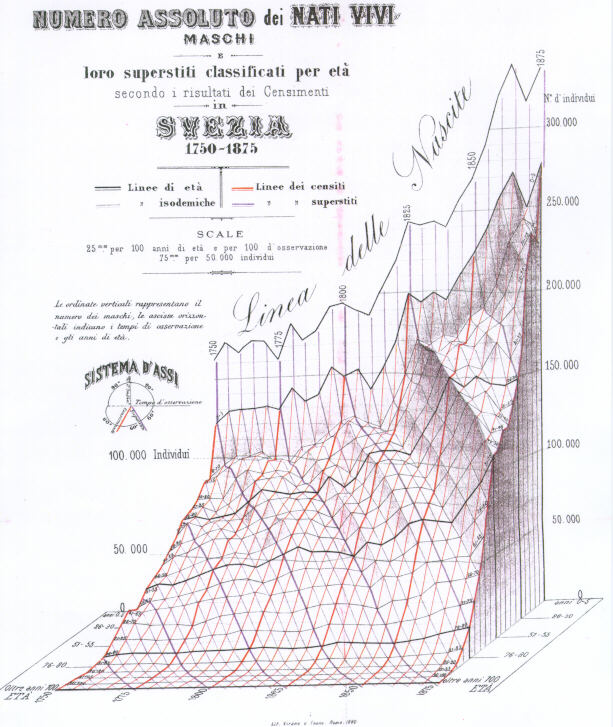

<!--
WORKING DRAFT -- not a package vignette yet.

Lives in issues/vignettes/ deliberately, not vignettes/: pkgdown scans and publishes everything
under vignettes/ on every `pkgdown::build_site()`, so a half-finished draft there would go live
by accident. issues/ is already .Rbuildignore'd and outside pkgdown's scan path.

When this is ready to ship:
  1. Add a proper vignette YAML header (rmarkdown::html_vignette + %\VignetteIndexEntry etc.)
  2. Add a references.bib and switch citations below to [@key] form
  3. git mv issues/vignettes/histdata-challenge-draft.Rmd vignettes/histdata-challenge.Rmd
  4. devtools::document(); devtools::check(); NEWS.md entry; rebuild pkgdown
     (see issues/TASKS.md's "Workflow: rebuilding pkgdown" checklist)

See issues/vignettes/histdata-challenge.md for the full planning/rationale behind every
decision below -- this file is the draft prose+code, that one is the working notes.
-->

```{r setup, include = FALSE}
knitr::opts_chunk$set(
  collapse = TRUE,
  comment = "##",
  warning = FALSE,
  message = FALSE,
  fig.width = 7,
  fig.height = 5
)
library(HistData)
library(ggplot2)
```

> RE-VISION *n.* ri-'vizh-en (ca. 1611) 1. To see again, possibly from a new perspective; *syn:*
> review, reconsideration, reexamination, retrospection. 2. An act of revising; *syn:* rewrite,
> alteration, transformation. (Merriam-Webster, 2002, quoted in Friendly, 2002)

## Introduction

The `HistData` package collects data behind some of the most important graphics in the history
of statistics and data visualization. Some of these still have stories to tell, and lessons
for historians, graphic designers and software developers.

I consider the package as a concrete, usable contribution to a program of research I call *statistical historiography*: The
use of modern statistical and graphic methods as tools to study problems and questions in the history of statistics and
and data visualization. A main goal of this is a better understanding of historical problems in science
and data analysis through the _process_ of trying to reproduce a graph or analysis using modern
methods. 

You are led to ask--- and _think_ about--- important questions of statistical historiography:

* _What was he thinking?_: How and why Charles Joseph Minard, Luigi Perozzo, John Snow, Michael Florent van Langren and other heroes in data visualization history chose some graphic form to tell their story.

* _How did he do it?_: The contributions of the past were mostly hand-drawn, but with incredible attention to _detail_: text labels on lines, curves, regions; drawn numbers to show the data; annotations to add sense to scales or convey the message more directly to the viewer.

* _Why was the resulting graphic considered so beautiful and important?_: Each of these datasets and their associated graphics solved, or contributed to, an important problem of their time. But they did so in a way that attracted attention and admiration

I call the process "re-visioning" -- meaning to *see again, hopefully in a new light*.
As such, they provide opportunities, and this **HistData Challenge** to reproduce them in R.

### Challenges

This idea first took shape the **Minard Challenge** that stemmed from my paper Friendly (2002), "Visions and Re-Visions of Charles Joseph
Minard". This reviewed decades of attempts -- by many different people, in many different tools
-- to reproduce and extend Minard's famous graphic of Napoleon's Russian campaign. That paper,
and the gallery of re-visions that grew out of it, is the model for this vignette: a catalog of
*kinds* of re-vision, applied not just to Minard but to any dataset in this package, plus a
running inventory of what's already been attempted (in `sandbox/`, by outside contributors, in
companion projects) and what's still open.

I should mention that the idea of a data visualization "Challenge" is an important one in this age
of online communication. Typically, they present a dataset, or a content theme, or just an image,
and invite participants to participate; sometimes prizes are awarded. 

Some examples illustrate the range of possibilities from such endeavors:

* **ASA Statistical Graphics Expositions**: starting in the early 1980s -- the well-known 1983
  Data Exposition (Donoho & Ramos's cars/mpg dataset) is often cited as the first, though a 1982
  precursor is also mentioned in some accounts -- the [Section on Statistical
  Graphics](https://community.amstat.org/jointscsg-section/home) of the American Statistical
  Association began a series of poster/paper sessions at the Joint Statistical Meetings organized
  around analysis of a single curated dataset, intended as an opportunity to share perspectives,
  approaches to the problem, and highlight developments in software. Some notable examples are
  the [`HistData::Pollen` data](../reference/Pollen.html) contained here and the baseball
  salary/performance data from the [1988 Exposition](https://rdrr.io/cran/vcd/man/Baseball.html)
  (based on the 1986 season), now shipped in the `vcd` package as `vcd::Baseball`.
  
* **Hotelling Society**: I was teaching a graduate course, [Psychology 6140: Multivariate Data Analysis](http://friendly.apps01.yorku.ca/psy6140/)
  at the time, and I had the idea to use the baseball data again to challenge my students to 
  "strut their stuff" and show off what they had learned in the course in a mock-conference setting
  I called the "Society for Exploration of Multivariate Data", or, in honor of Harold Hotelling, the
  ["Hotelling Society"](http://friendly.apps01.yorku.ca/psy6140/bb/basecall.htm). I used the 
  [Baseball dataset](http://friendly.apps01.yorku.ca/psy6140/bb/basedata.htm) for this, with data
  provided in SAS and SPSS format.
  
  But students were encouraged to extend the scope with other baseball-related datasets or questions.
  Students dressed the part, a "7th inning stretch" included beer and pizza, and a fictitious 
  guest speaker, Izzy A. Ringer, presented conclusive proof that Shoeless Joe Jackson did NOT throw
  the 1919 World Series -- the Black Sox Scandal, in which Jackson and seven Chicago White Sox
  teammates were accused of intentionally losing to the Cincinnati Reds. The upshot was that we
  all had fun with this, and it contributed
  to understanding of use of methods of the course and conveying results for a conference presentation.

  The baseball data itself outlived the course: working with it for the Hotelling Society is what
  led, eventually, to devloping the [`Lahman`](https://github.com/cdalzell/Lahman) R package,
  which packages Sean Lahman's baseball database directly for R users -- itself a small case of
  one challenge (teach a course, make the data usable) turning into a durable, reusable piece of data 
  for baseball research. This is the same trajectory `HistData` itself follows on a larger scale.

* **[Kaggle Competitions](https://www.kaggle.com/competitions)**: machine-learning contests run
  on the Kaggle data science platform, from beginner "Getting Started" competitions like
  [*Titanic: Machine Learning from Disaster*](https://www.kaggle.com/c/titanic) (predict who
  survived, from passenger data) to prize-money contests sponsored by companies and research
  groups. Not about historical re-visioning specifically, but the same competitive/participatory
  spirit -- a public dataset, a shared task, and a leaderboard of attempts to compare against.

* **[30DayChartChallenge](https://github.com/30DayChartChallenge/Edition2025)**: one chart a day
  for the month of April, each day keyed to a themed prompt (e.g. "part-to-whole," "historical,"
  "3D"). Started in 2021 by Cédric Scherer and Dominic Royé as a follow-on to the
  #30DayMapChallenge. John Russell's recreations of several `HistData` datasets, used throughout
  this vignette, came from the 2025 edition -- see the `sandbox/` inventory below.

* **[TidyTuesday](https://github.com/rfordatascience/tidytuesday)**: a weekly data project run by
  the R4DS ("R for Data Science") online learning community since 2018 -- a new real-world
  dataset posted every Monday, participants share their own wrangling/visualization of it. Less
  about re-visioning one specific historical graphic and more about practicing data skills on
  whatever dataset comes up that week.

* **[#DuBoisChallenge](https://github.com/ajstarks/dubois-data-portraits)**: launched in 2021 by
  Allen Hillery, Anthony Starks, and Sekou Tyler specifically to recreate W. E. B. Du Bois's
  hand-drawn data visualizations from the 1900 Paris Exposition using modern tools. Closest in
  spirit to this vignette's own framing of all the challenges above -- explicitly about
  revisiting one historical body of graphic work, not a general prompt-of-the-day format.


### A tiny motivating example: `Arbuthnot`

Before anything as ambitious as tackling Minard or John Snow, a simple example makes a small point of statistical
historiography concretely. 
John Arbuthnot's data on the sex ratios of males to females in the
christenings in London (1629-1710) look, on a first read, like a straightforward
annual count. But Sandy Zabell (1976) found that the values for 1674 and 1704 are identical --
not approximately close, *identical*, down to a ratio computed to three decimal places -- strongly
suggesting one year's entry was copied from the other, whether by Arbuthnot himself or a later
transcriber.

```{r arbuthnot-duplicate}
data(Arbuthnot)
Arbuthnot[Arbuthnot$Year %in% c(1674, 1704), c("Year", "Males", "Females", "Ratio")]
```

`Males`, `Females`, and the derived `Ratio` match exactly; only `Plague` and `Mortality` (not
shown) differ. A table alone makes this easy to miss among 82 rows. Plotting the series makes it
harder to miss -- the two points sit at *exactly* the same height, 30 years apart, in a series
that otherwise wanders:

```{r arbuthnot-plot}
ggplot(Arbuthnot, aes(x = Year, y = Ratio)) +
  geom_line(color = "grey50") +
  geom_point(color = "grey50") +
  geom_point(
    data = subset(Arbuthnot, Year %in% c(1674, 1704)),
    color = "firebrick", size = 6
  ) +
  labs(
    title = "Arbuthnot's sex ratio at christening, 1629-1710",
    subtitle = "1674 and 1704 (red) are identical -- likely a copying error",
    y = "Male / female ratio"
  ) +
  theme_minimal()
```

That's re-visioning in miniature: looking again at old data, graphically, surfaces something
tabulation alone hides. Wainer & Spence (2005) give the fuller account and push the point
further. The scale of the anomaly is worth stating plainly: 1704 falls about 4,000 christenings
short of what its neighbors predict, and the true figure -- 15,895 (8,153 boys, 7,742 girls) --
sits comfortably between 1703 and 1705, exactly where a corrected value should. Had Arbuthnot
ever plotted his own data, they argue, the error would have stood out "like a sore thumb" --
that he apparently never did is itself the historiographic finding, not a personal failing: it's
evidence that graphing data simply wasn't yet part of a statistician's toolbox in 1710.
Re-visioning the graph doesn't just fix a 300-year-old data error; it exposes a working
assumption of Arbuthnot's era that no longer holds today.

See Zabell (1976) for the original discovery, and Zabell & Wainer (2002) and Wainer & Spence
(2005) for the fuller story.

### What is re-visioning?

Historians of statistics have practiced "re-visioning" long before this vignette put a name to
it -- going back to an original historical graphic or dataset itself, not just its published
conclusions, to understand it on its own terms, in its own time. Some examples here follow the same pattern as
`Arbuthnot` above, at a larger scale.

Stephen Stigler does this throughout *The History of Statistics* (1986) and in papers devoted
specifically to it: "Francis Galton's Account of the Invention of Correlation" (1989)
re-examines Galton's own scatter diagram of parent/child heights to work out how Galton actually
arrived at correlation, and "Regression Towards the Mean, Historically Considered" (1997) does
the same for Galton's geometric argument for regression -- reconstructing the reasoning behind a
graphic, not just restating its result.

David Bellhouse (with Laura Murray) does something similar for a much earlier and more
painstaking case: Murray & Bellhouse (2017) work out how Edmond Halley actually constructed his
1701 map of magnetic declination -- a map, not a table -- using only the methods and instruments
available to Halley at the time.

*(TODO: a paragraph on James Hanley's (McGill) work on `Student`/Gosset, pending the email
content referenced in an earlier note.)*

[James Hanley](https://jhanley.biostat.mcgill.ca) has been a constant contributor to this line of inquiry, publishing detailed datasets and inquiries that go well beyond what was contained in an original work.
TODO: fill in here, from stuff below

TODO: Hanley materials, not all to be used here-- but the first one is what I meant in my note, and the Gosset one is also worth mentioning.

https://jhanley.biostat.mcgill.ca/Student/ - Height and finger-length data, gathered by Macdonell (1901), and used by Student (1908), published in: Hanley, J. and Julien, M. and Moodie, E. (2008). Student's z, t, and s: What if Gosset had R? The American Statistician, 62(1), 64-69.
This is reflected in `HistData::Macdonell

https://jhanley.biostat.mcgill.ca/Gosset/ - Re-enactment of Gosset's counting of yeast cells
as described in the 1907 Biometrika article
This is reflected in `HistData:Yeast`, also used by John Russel in `sandbox/Yeast.R`

vcdExtra::Draft 1970 dataset 
  https://jhanley.biostat.mcgill.ca/Reprints/LestWeForgetUSSelectiveServiceLotteries1917-2019.pdf
  https://jhanley.biostat.mcgill.ca/DraftLotteries/ - US Selective Service Lotteries 1917-1975: Datasets
  - Don't use this here. But make a note that this should be cited and described for `vcdExtra::Draft1970`


## A taxonomy of re-visions

The gallery accompanying Friendly (2002), <https://www.datavis.ca/gallery/re-minard.php>,
catalogs about 15 different re-visions of the Minard graphic. This can be read as a checklist rather than a
one-off catalog, they sort into six recognizable *kinds* of re-vision -- a rubric that applies to
any HistData dataset, not just Minard's.

### 1. Software/language ports

The same graphic, redrawn in a different tool: Mathematica, a formal Grammar-of-Graphics
specification, ggplot2, SAS/IML, Protovis. The content doesn't change; what changes is what the
choice of tool reveals about the graphic's underlying structure -- a grammar-of-graphics port, for
instance, forces you to name the mapping from data to visual channel explicitly, in a way the
original hand-drawn version never had to.

A software port is only as easy as the data behind it lets it be, and `HistData` deliberately
pre-parses some of its more complex graphics into separate, composable pieces rather than one
monolithic table -- the same decomposition the original artist implicitly made when laying out
the figure. Snow's cholera map is really five aligned layers (`Snow.deaths`, `Snow.pumps`,
`Snow.streets`, `Snow.polygons`, `Snow.dates`), and Minard's march is three (`Minard.cities`,
`Minard.troops`, `Minard.temp`: places, the flow band itself, and the temperature graph beneath
it). Porting the graphic to a new tool becomes a matter of re-mapping each existing piece onto
that tool's own layer/channel model, rather than re-deriving the decomposition from scratch --
see the `Minard` case study below, built directly from these three data frames.

### 2. Design variations

Same content, same tool family, different design decisions: legibility fixes, a graphic
designer's redraw, an alternate visual metaphor (Minard's gallery includes a pictograph version
emphasizing human cost over cartographic accuracy). This is the category where taste and
communication goals do the most work.

### 3. Interactive/web-based

Tooltips, drill-down, linked views, map overlays -- re-visions that trade the fixed, printed page
for something a reader can query. The Minard gallery includes an image map with linked text and a
drill-down SAS GMAP; this is also the natural home for the `plotly` version of `Perozzo` below.

### 4. Temporal/animated

A step-by-step reveal, a third axis given over to time, a narrated video. Minard's original
already compresses time into distance along the march route; an animated re-vision instead lets
time *play out*, trading the compression for a different kind of legibility. (See "Open
invitations" below for the deferred `gganimate` idea for `Perozzo`.)

A concrete example: Ron Kennett's "moving bubble" animated re-vision, which replaces Minard's
static flow band with a single traveling bubble sized to the army's current strength, sweeping
along the march route as time advances. *(Image on file, `Kennet-moving-bubble.gif`; embedding
pending the general image-hosting/licensing decision noted above.)*

### 5. Alternative representations

A genuinely different chart type for the same underlying data -- not a redraw, a rethink. The
`Snow-density.R` case study below (density contours instead of point symbols for cholera deaths)
is this category in miniature.

### 6. Data packaged for reuse

The original figures plus the underlying data, released in a form someone else can build on. This
is, quite literally, what the `HistData` package itself does for all 34 of its datasets --
arguably the least glamorous but most consequential category, since every other kind of re-vision
in this list depends on having data to play with first.

*(TODO: pull a representative thumbnail image from the datavis.ca gallery for each category above
once hosting/licensing for third-party images is sorted out -- see `issues/vignettes/histdata-challenge.md`.)*

## Challenges already named in HistData

Several datasets in this package already carry an explicit "go recreate or improve this" note in
their documentation:

| Dataset | Nature of the challenge |
|---|---|
| [`Minard`](../reference/Minard.html) | "Minard's Challenge": reproduce the March on Moscow graphic with modern tools (Friendly, 2002). |
| [`Guerry`](../reference/Guerry.html) | Friendly (2007): "Challenges for Multivariable Spatial Analysis." |
| [`Playfair1824`](../reference/Playfair1824.html) | Re-create Playfair's last chart, or do better, using modern graphics. |
| [`Perozzo`](../reference/Perozzo.html) | Get closer to Perozzo's hand-drawn stereogram, or do better in some way -- the case study below. |
| [`Pollen`](../reference/Pollen.html) | The original 1986 ASA JSM "Data Challenge" -- a synthetic 5D dataset with several deliberately hidden features. |
| [`OldMaps`](../reference/OldMaps.html) | Open call to relate map accuracy to other characteristics of each map. |

This first draft works two of these (`Minard`, `Perozzo`) in depth, plus one further example from
outside the package's own docs (`Snow`, via John Russell's 30DayChartChallenge). The rest stay
listed here, cited, and open -- see "Open invitations."

## Case study: `Minard`

Minard drew his 1869 original by hand, in ink, as a single sheet: a tapering flow band tracing
the army's size and location, paired with a temperature graph along the same horizontal axis.
Friendly (2002) catalogs around 15 later re-visions of it, spanning every category in the
taxonomy above; this section builds one of them directly (a software/language port), then
points to gallery entries for a few more.

### A software/language port, built from `Minard.cities`/`Minard.troops`/`Minard.temp`

As noted in "Software/language ports" above, the march itself decomposes into `Minard.cities`
(places), `Minard.troops` (the flow band -- each row a vertex, `survivors` giving the band's
width, `direction` its color, `group` which sub-path it belongs to), and `Minard.temp` (the
temperature series, not used in this panel). Porting to ggplot2 is then mostly a matter of
mapping `survivors` to `linewidth` and `direction` to `colour`:

```{r minard-ggplot}
data(Minard.cities); data(Minard.troops)

ggplot(Minard.troops, aes(x = long, y = lat)) +
  geom_path(aes(linewidth = survivors, colour = direction, group = group),
            lineend = "round") +
  scale_linewidth(range = c(0.5, 15), guide = "none") +
  scale_colour_manual(values = c(A = "grey50", R = "firebrick"), guide = "none") +
  geom_point(data = Minard.cities, size = 1.2) +
  geom_text(data = Minard.cities, aes(label = city), vjust = 1.5, hjust = 0.5, size = 3) +
  labs(title = "Napoleon's Russian campaign of 1812", x = NULL, y = NULL) +
  theme_minimal() +
  theme(axis.text = element_blank(), panel.grid = element_blank())
```

Grey is the advance on Moscow, red the retreat; band width still carries troop strength, exactly
as in the 1869 original, with none of `HistData`'s decomposition into separate data frames
lost in translation.

### A few more, from the gallery

The rest of Friendly (2002)'s catalog isn't reproduced here (some entries are third-party work
with licensing not yet sorted out for redistribution -- see `issues/vignettes/Minard-images.md`),
but is worth naming by taxonomy category, all viewable at
<https://www.datavis.ca/gallery/re-minard.php>:

- **Design variation**: Gene Zelazny's pictograph redesign -- soldier silhouettes standing in for
  the flow band, a Napoleon portrait and Moscow's onion domes flanking the numbers, thermometer
  icons instead of a temperature line. Same data, a completely different set of design decisions
  about what to foreground.
- **Interactive/web-based**: a Protovis port overlaying the flow band directly on a pannable,
  zoomable Google Map of the actual terrain -- the natural next step past a static basemap, and
  in the same category as the `plotly` version of `Perozzo` above.
- **Temporal/animated**: Ron Kennett's moving-bubble re-vision, already named in the taxonomy
  section above.

## Case study: `Perozzo`

Perozzo's 1880/1881 stereogram plots survivor counts as a surface over `Year` x `Age`, and does
it by hand, in ink, with its own four-way legend ("Sistema d'Assi"): black for the age
cross-sections, red for the census-year cross-sections, dashed lines for isodemic (equal-
population) contours, and violet for the cohort-survivorship diagonals themselves.

{width=70%}

The package supplies a simple base-R version already:

```{r perozzo-setup}
data(Perozzo)
Pmat <- xtabs(Survivors ~ Year + Age, data = Perozzo)
years <- as.numeric(rownames(Pmat))
ages  <- as.numeric(colnames(Pmat))
```

The most basic example, from the documentation, shows a simple perspective plot (`graphics::persp()`) of the 3D surface. Some fiddling was necessary to get the orientation approximately right. 

  

```{r perozzo-base, fig.height = 5}
ages_rev <- -rev(ages)
Pmat_rev <- Pmat[, rev(seq_along(ages))]
persp(years, ages_rev, Pmat_rev,
      xlab = "Year", ylab = "Age", zlab = "Survivors",
      theta = 0, phi = 25, expand = 0.6,
      col = adjustcolor("lightblue", alpha.f = 0.5), shade = 0.5)
```

That base plot loses most of what makes Perozzo's original worth looking at: no sense of the
steep "wall" of large numbers at `Age = 0`, no highlighted reference lines, and no cohort
diagonals at all. 

All four are answerable directly with `persp()`, without leaving base R -- it
returns a 4x4 projection matrix from each call, and `trans3d()` + `lines()` can then draw more
3D-located lines onto the same plot after the fact.

```{r perozzo-enhanced, fig.height = 6}
colnames(Pmat_rev) <- as.character(ages_rev)  # match column names to ages_rev's sign flip

# re-angled to bring the Age = 0 "wall" of large young-survivor counts forward
pmat <- persp(years, ages_rev, Pmat_rev,
      xlab = "Year", ylab = "Age", zlab = "Survivors",
      theta = -30, phi = 20, expand = 0.6, r = 4,
      col = adjustcolor("lightblue", alpha.f = 0.4), shade = 0.5)

# red: highlight both cross-section families -- Survivors-by-Age at each Year,
# and Survivors-by-Year at each Age -- every 25 years/years-of-age
hi_years <- years[years %% 25 == 0]
for (yr in hi_years) {
  z <- Pmat_rev[as.character(yr), ]
  lines(trans3d(rep(yr, length(ages_rev)), ages_rev, z, pmat), col = "red", lwd = 2)
}
hi_ages <- ages[ages %% 25 == 0]
for (ag in hi_ages) {
  z <- Pmat_rev[, as.character(-ag)]
  lines(trans3d(years, rep(-ag, length(years)), z, pmat), col = "red", lwd = 2)
}

# blue: birth-cohort diagonals -- Year = birth year + Age -- every 25 years,
# starting from the Age = 0 edge (cohorts born during the observation window)
# and the Year = 1750 edge (cohorts already alive when it starts)
cohort_starts <- rbind(
  data.frame(year0 = years[years %% 25 == 0], age0 = 0),
  data.frame(year0 = 1750, age0 = ages[ages %% 25 == 0 & ages > 0])
)
for (i in seq_len(nrow(cohort_starts))) {
  b  <- cohort_starts$year0[i]
  a0 <- cohort_starts$age0[i]
  k  <- 0:((100 - a0) / 5)
  Y  <- b + 5 * k
  A  <- a0 + 5 * k
  keep <- Y >= min(years) & Y <= max(years) & A <= 100
  Y <- Y[keep]; A <- A[keep]
  if (length(Y) < 2) next
  z <- mapply(function(y, a) Pmat[as.character(y), as.character(a)], Y, A)
  lines(trans3d(Y, -A, z, pmat), col = "blue", lwd = 2)
}
```

Red isn't an arbitrary choice: it's Perozzo's own color for the census-year cross-sections (see
the original image above). Blue is a substitute for his violet, used here for the
cohort-survivorship diagonals instead, since violet on top of the light-blue surface shading was
too easily lost. Those diagonals are the real payoff: each blue line is a single Swedish birth
cohort, and you can read its survivorship directly off the line's height as it recedes into the
surface, generation by generation -- the "crucially" bit that a same-year cross-section alone
can't show.

### Re-vision 1: ggplot2 raster + contour

A straightforward "alternative representation" re-vision: give up the 3D illusion entirely in
favor of a 2D heatmap with isolines, which trades the stereogram's dramatic silhouette for exact,
directly-comparable values.

```{r perozzo-ggplot-contour}
ggplot(Perozzo, aes(x = Year, y = Age, z = Survivors)) +
  geom_raster(aes(fill = Survivors)) +
  geom_contour(color = "white", alpha = 0.6) +
  scale_fill_distiller(palette = "Blues", direction = 1) +
  scale_y_reverse() +
  labs(title = "Perozzo's survivorship grid, as a heatmap") +
  theme_minimal()
```

### Re-vision 2: a fake-3D isometric shear

A "design variation": keep the 3D *look* Perozzo was after, but build it as an ordinary 2D ggplot
via a manual isometric shear (offsetting each `Age` slice horizontally and vertically as a
function of `Age`), rather than `persp()`'s true 3D projection. Unlike `persp()`, this gets full
access to ggplot's color scales, legends, and layering.

```{r perozzo-isometric}
shear <- 0.6   # horizontal points per year of age; tune to taste
lift  <- 400   # vertical Survivors-units per year of age

Perozzo_iso <- transform(Perozzo,
  x_iso = Year + shear * Age,
  y_iso = Survivors + lift * Age
)

ggplot(Perozzo_iso, aes(x = x_iso, y = y_iso, group = Age, color = Age)) +
  geom_line() +
  scale_color_distiller(palette = "Blues", direction = 1) +
  labs(
    title = "Perozzo's stereogram as a 2D isometric shear",
    x = "Year (sheared by Age)", y = "Survivors (lifted by Age)"
  ) +
  theme_minimal() +
  theme(axis.text.x = element_blank(), axis.text.y = element_blank())
```

*(Rough first pass -- the shear/lift constants above are not tuned, and this doesn't yet attempt
Perozzo's actual oblique axis convention. Revisit before shipping.)*

### Re-vision 3: an interactive `plotly` surface

An "interactive/web-based" re-vision, and arguably the most direct modern analogue of a physical
stereogram: something a reader can actually rotate, rather than a single fixed viewing angle.

```{r perozzo-plotly}
library(plotly)
plot_ly(x = ~years, y = ~ages, z = ~Pmat, type = "surface") |>
  layout(scene = list(
    xaxis = list(title = "Year"),
    yaxis = list(title = "Age"),
    zaxis = list(title = "Survivors")
  ))
```

### Still open

The one Perozzo idea from `R/Perozzo.R`'s `@details` not attempted anywhere above is animating
across `Year`, letting each birth cohort's diagonal "arrive" in sequence rather than showing all
of them at once (the `gganimate` idea in "Open invitations" below).

## Case study: `Snow`, via John Russell's 30DayChartChallenge

Of the `sandbox/` scripts recreating Russell's [30DayChartChallenge
2025](https://github.com/drjohnrussell/30DayChartChallenge) entries, `Snow-density.R` was picked
for this draft because it needs no dependencies beyond `ggplot2` (see
`issues/vignettes/histdata-challenge.md` for the full dependency audit of every candidate script),
and because it's a genuine "alternative representation" of one of the package's most iconic
datasets: density contours instead of point symbols for cholera deaths, layered over Snow's
original street map.

```{r snow-density}
data(Snow.deaths); data(Snow.pumps); data(Snow.streets)

ggplot(Snow.deaths, aes(x = x, y = y)) +
  geom_line(data = Snow.streets, aes(x = x, y = y, group = street),
            color = "black", linewidth = 0.5) +
  geom_point(alpha = 0.6) +
  geom_density_2d_filled(bins = 4, show.legend = FALSE) +
  geom_density_2d(bins = 4, color = "black", alpha = 0.6) +
  scale_fill_manual(values = c("#FFFFFF00", "#F0808030", "#FF000030", "#8B000080")) +
  geom_label(data = Snow.pumps, aes(x = x, y = y, label = label),
             size = 3, color = "grey20", fill = "lightblue", alpha = 0.9) +
  theme_void() +
  labs(
    title = "John Snow's Cholera Map",
    subtitle = "With contour lines showing densities of death",
    caption = "Data: HistData::Snow.deaths / Snow.pumps / Snow.streets"
  )
```

Adapted from `sandbox/Snow-density.R` (originally: John Russell,
[Challenge11.R](https://github.com/drjohnrussell/30DayChartChallenge/blob/main/2025/Challenge11.R)).

## Open invitations

Not attempted in this draft -- a literal "here's what's left" list:

- **`Guerry`, `Playfair1824`, `Pollen`, `OldMaps`** -- named and cited above, not worked
  through in depth in this first draft.
- **`Perozzo` animated (`gganimate`)** -- held for a later draft; would add `gganimate` (+ a
  renderer) to `Suggests`. See "Still open" above.
- **Every other dormant `sandbox/` script** not chosen for the live case study above --
  `Galton-PearsonLee.R`, `Mcdonnell-density.R`, `Pyx-ggbump.R`, `Virginis-plot.R`,
  `Arbuthnot-PieGlyph.R`, `Cholera-plots.R`, `Nightingale-graph.R`, `Guerry-map.R`,
  `OldMaps-plot-map.R` -- each linked from its dataset's docs but never executed/shown; see the
  planning doc for what each would need beyond current `Suggests`.
- **`Ebbinghaus`** -- a not-yet-imported dataset (`issues/TASKS.md`), unrelated to any graphic
  challenge but still genuinely unfinished package work.
- **Rennie's fuller Snow map recreation** -- needs external data files not present in this repo;
  linked from `Snow.Rd` but can't be re-run here.
- **`Langren1644`** -- a *third* independent re-vision exists in [this
  blog post](https://friendly.github.io/blog/posts/2026-07-van-langren/)'s "Bonus: Reproducing
  Langren's 1644 Graph" section, alongside the package's own long-standing ggplot2 example and
  `sandbox/Langren-graph.R`. Worth a short paragraph on the design trade-offs between the three,
  not developed here yet.

## Going further

- Friendly, M. & Wainer, H. (2021). *A History of Data Visualization and Graphic Communication*.
  Harvard University Press.
- Companion site: <https://friendly.github.io/HistDataVis/> -- R code "reconstructions of
  historical graphs" tied to each book chapter.
- Gallery of Data Visualization (GDV), referenced in Friendly (2002).
- <https://www.datavis.ca/gallery/re-minard.php> -- the re-visions gallery this vignette's
  taxonomy is drawn from.

## References

*(Plain-text for now; convert to a `references.bib` + `[@key]` citations before this ships -- see
the note at the top of this file.)*

- Friendly, M. (2002). Visions and Re-Visions of Charles Joseph Minard. *Journal of Educational
  and Behavioral Statistics*, 27(1), 31-51.
- Friendly, M. (2007). A.-M. Guerry's Moral Statistics of France: Challenges for Multivariable
  Spatial Analysis. *Statistical Science*, 22, 368-399.
- Zabell, S. (1976). Arbuthnot, Heberden and the Bills of Mortality (Technical Report No. 40).
  Department of Statistics: The University of Chicago.
- Zabell, S., & Wainer, H. (2002). A Small Hurrah for the Black Death. *Chance*, 15(4), 58-60.
- Wainer, H., & Spence, I. (2005). Graphical Presentation of Longitudinal Data. In *Encyclopedia
  of Statistics in Behavioral Science*. Wiley.
- Stigler, S. M. (1986). *The History of Statistics: The Measurement of Uncertainty before 1900*.
  Harvard University Press.
- Stigler, S. M. (1989). Francis Galton's Account of the Invention of Correlation. *Statistical
  Science*, 4(2), 73-79.
- Stigler, S. M. (1997). Regression towards the mean, historically considered. *Statistical
  Methods in Medical Research*, 6(2), 103-114.
- Murray, L. L., & Bellhouse, D. R. (2017). How Was Edmond Halley's Map of Magnetic Declination
  (1701) Constructed? *Imago Mundi*, 69(1), 72-84.
